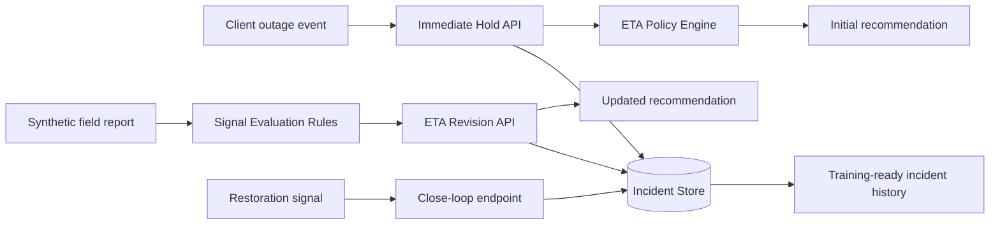

# Outage Intelligence MVP

[](LICENSE)


Public-safe MVP for an event-driven outage intelligence workflow. The system accepts outage notifications from enterprise clients, returns an immediate ETA recommendation, revises that ETA when field evidence arrives, applies a timeout failsafe when evidence is missing, and stores restoration ground truth for future machine learning work.

## Status

- Portfolio-ready public demo
- Public-safe synthetic data only
- Tested workflow for create, revise, timeout, and restore

## Tech stack

- Backend: FastAPI, Pydantic
- Persistence: SQLite
- Decision layer: deterministic rules engine
- Testing: pytest, FastAPI TestClient
- Packaging: Docker, docker-compose, Makefile

## What problem this project solves

Power-sensitive sites often need a fast answer to a practical question: wait for utility restoration or dispatch backup resources now. Acting too early wastes cost. Acting too late risks avoidable downtime.

This MVP demonstrates a two-step decision pattern:

1. Return an immediate recommendation as soon as an outage is reported.
2. Revise the ETA once field evidence provides better context.

The result is a system that delivers operational value immediately while also creating a clean data trail for later model development.

## Architecture overview

The repo models a compact event-driven service built around FastAPI, a lightweight rules engine, and SQLite for local persistence.



Core repository areas:

- `apps/api/` FastAPI service, schemas, rules, and demo scenario
- `architecture/` system diagrams and state machine notes
- `docs/` API contract, business framing, governance, and ML roadmap
- `data/synthetic/` synthetic field-message examples only
- `tests/` API workflow coverage for incident create, revise, timeout, and restore
- `infra/` local containerization assets

## Two-step API flow

### Step 1: Immediate hold response

`POST /api/v1/incidents` creates an incident and returns an initial ETA recommendation based on the incoming outage state.

Example request:

```json
{
  "client_name": "DemoOperator",
  "site_id": "SITE-1001",
  "province": "North Zone",
  "scada_status": "OUTAGE_CONFIRMED"
}
```

### Step 2: ETA revision from field evidence

`POST /api/v1/incidents/{incident_id}/signals/field` ingests a synthetic field report, extracts severity cues through deterministic rules, and revises ETA when needed.

Example request:

```json
{
  "channel": "FIELD_APP",
  "raw_text": "Field crew reports pole down and conductor snapped near segment A"
}
```

## Timeout failsafe

When no useful field evidence arrives within the configured window, the service can apply a worst-case ETA through `POST /api/v1/incidents/{incident_id}/timeout-check`.

This prevents the workflow from stalling in an ambiguous state and gives downstream operations a deterministic fallback for backup-dispatch decisions.

## Close-loop ground truth

`POST /api/v1/incidents/{incident_id}/restore` closes the incident and records the restoration timestamp plus restoration source.

That close-loop signal is important because it turns the MVP into more than a demo API:

- it captures the actual restoration outcome
- it enables ETA error analysis
- it creates supervised-learning targets for future models

## Public-safe design

This repository is intentionally sanitized for public sharing and interview use.

- All examples use synthetic data.
- No real credentials, tokens, network endpoints, or topology are included.
- No real field communications or client-side identifiers are included.
- Naming has been generalized to avoid organization-specific language.
- The rules engine is deterministic and inspectable, which keeps the demo easy to review.

More detail is available in [docs/security-and-governance.md](docs/security-and-governance.md).

## Future ML roadmap

The current implementation is intentionally rules-first. That keeps the MVP explainable and easy to validate while generating the incident history needed for later ML work.

Planned evolution:

1. Build a labeled incident dataset from closed-loop restoration records.
2. Add richer structured features such as region, weather, and network-segment context.
3. Train ETA prediction and prolonged-outage risk models.
4. Introduce confidence scoring and policy thresholds for operational recommendations.
5. Move from purely synchronous processing to queue-backed event handling for scale.

See [docs/ml-roadmap.md](docs/ml-roadmap.md) for the longer-term direction.

## Quick start

```bash
python -m venv .venv
source .venv/bin/activate  # Windows: .venv\Scripts\activate
pip install -r requirements.txt
python scripts/seed_demo_data.py
uvicorn apps.api.main:app --reload
```

Useful local endpoints:

- API docs: `http://127.0.0.1:8000/docs`
- Demo dashboard: `http://127.0.0.1:8000/demo/incidents`

## Interview-friendly summary

This project shows how to design an event-driven outage workflow that delivers immediate operational value now and accumulates training data for future ML improvements, without exposing internal systems or real-world sensitive data.
