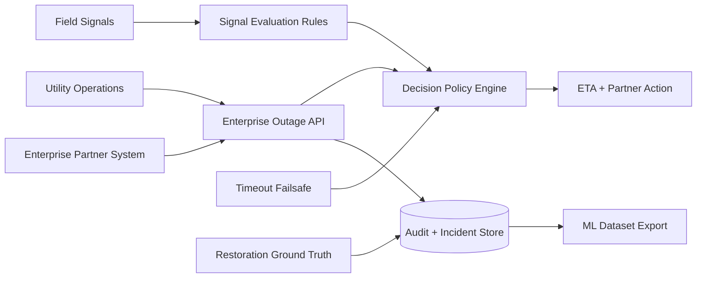

# Enterprise Outage Intelligence Platform

[](LICENSE)


Enterprise outage intelligence API for utility-to-partner coordination. This public-safe product prototype shows how a utility-style organization could coordinate outage ETA, partner operational decisions, audit events, timeout fallback, and restoration ground truth with large enterprise partners such as telecom operators, data centers, industrial estates, hospital networks, or other critical infrastructure operators.

This repository is a synthetic reference implementation. It is not a production system, does not represent a live organizational deployment, and does not imply any actual partnership with named companies.

## Product Status

- Public-safe enterprise product prototype
- Synthetic data, synthetic identifiers, and no real partner payloads
- Tested workflows for incident creation, ETA revision, timeout fallback, restoration closure, idempotency, and audit trail
- Optional sandbox API-key boundary for partner pilot conversations
- Partner sandbox profiles with site-scope boundaries and webhook mode metadata
- Local webhook outbox with signed payload metadata, delivery attempts, and retry scheduling for sandbox integration design
- Executive demo page and read-only summary feed for a 3-minute partner pilot walkthrough
- Operator pilot console and read-only summary feed for NOC-style workflow review
- Private pilot evidence report for workflow, risk, webhook, and evaluation discussion
- Repeatable partner sandbox integration flow for idempotency, retry, timeout, and restoration proof
- Private sandbox readiness gate and public-safe scan for pilot go/no-go discussion
- Pilot scenario matrix for repeatable benchmark coverage across outage, retry, timeout, restore, and scope-control cases
- ML baseline benchmark comparing rules-first ETA with simple statistical baselines
- Pilot data contract and shadow evaluation protocol for private sandbox discussion
- Partner pilot onboarding and governance pack for enterprise pilot planning
- ML-ready closed-loop export and simple ETA baseline

## Tech Stack

- Backend: FastAPI, Pydantic
- Persistence: SQLite
- Decision layer: deterministic rules engine
- Testing: pytest, pytest-cov, FastAPI TestClient
- Packaging: Docker, docker-compose, Makefile

## Enterprise Use Case

Large power-dependent organizations need fast, explainable answers during utility outages:

- Should the partner wait for expected utility restoration?
- Should backup operations be prepared?
- Should backup power, fuel logistics, or field escalation be activated now?
- What evidence changed the ETA?
- What ground truth can improve future ETA accuracy?

The platform answers these questions with a two-step operating pattern:

1. A partner or enterprise account workflow sends a synthetic outage event.
2. The API returns an immediate ETA decision and partner action.
3. Field evidence revises the ETA and confidence band.
4. A timeout failsafe prevents ambiguous incidents from stalling.
5. Restoration closure creates ground truth for analytics and future ML.

## Architecture Overview



Core repository areas:

- `apps/api/` FastAPI service, schemas, rules, and demo surface
- `architecture/` system overview and state-machine documentation
- `docs/` API contract, partner integration, governance, product readiness, evaluation, and ML roadmap
- `data/synthetic/` synthetic messages and closed incidents only
- `tests/` API and rule regression coverage
- `infra/` local containerization assets

## Partner Integration Flow

### 1. Create an enterprise outage incident

`POST /api/v1/incidents` accepts a partner-safe outage event and returns an immediate decision.

```json
{
  "client_name": "DemoEnterprisePartner",
  "partner_id": "partner-telecom-sandbox",
  "site_id": "SITE-1001",
  "province": "North Zone",
  "scada_status": "OUTAGE_CONFIRMED",
  "source_event_id": "SRC-EVENT-1001"
}
```

The response includes:

- current incident state
- ETA recommendation
- partner action
- confidence band
- policy explanation
- SLA-style timeout behavior

Sandbox partner auth can be enabled by configuring `OUTAGE_SANDBOX_API_KEYS` and sending `X-Partner-Id` plus `X-API-Key`. If no keys are configured, auth stays disabled so the public prototype remains easy to run locally.

### 2. Configure a partner sandbox profile

`PUT /api/v1/partners/{partner_id}/sandbox-profile` stores public-safe pilot metadata such as partner class, allowed synthetic site prefixes, and webhook mode. This lets the prototype demonstrate tenant-aware scope checks without exposing real topology or partner details.

### 3. Revise ETA from field evidence

`POST /api/v1/incidents/{incident_id}/signals/field` ingests a synthetic field signal, stores it in the audit trail, and revises the ETA when the policy engine finds stronger evidence.

```json
{
  "channel": "FIELD_APP",
  "raw_text": "Field crew reports pole down and conductor snapped near segment A",
  "source_signal_id": "SRC-SIGNAL-1001"
}
```

### 4. Apply timeout fallback

`POST /api/v1/incidents/{incident_id}/timeout-check` applies a deterministic worst-case ETA if the incident has not received useful evidence within the configured timeout window. The operation is idempotent.

### 5. Close the loop with restoration ground truth

`POST /api/v1/incidents/{incident_id}/restore` closes the incident, records restoration metadata, and makes the case available for analytics export.

### 6. Inspect partner webhook delivery records

The prototype uses a local webhook outbox rather than sending HTTP callbacks. This keeps the public repo safe while still demonstrating retry-safe partner notification design.

- `GET /api/v1/webhook-deliveries`
- `GET /api/v1/webhook-deliveries/{event_id}`
- `POST /api/v1/webhook-deliveries/{event_id}/retry`
- `GET /api/v1/webhook-deliveries/{event_id}/attempts`
- `POST /api/v1/webhook-deliveries/{event_id}/attempts`

When `OUTAGE_WEBHOOK_SECRET` is configured, queued delivery records include an HMAC-style `X-Webhook-Signature`. Without a configured secret, payloads are explicitly marked as `unsigned`.

### 7. Walk through the executive demo

`GET /demo/incidents` renders a public-safe executive walkthrough. `GET /api/v1/demo/executive-summary` provides the same sanitized story as JSON for demo automation or future dashboard work.

The demo focuses on:

- executive summary metrics
- partner journey timeline
- decision rationale
- webhook delivery state
- ML-ready ground truth coverage

### 8. Review the operator pilot console

`GET /demo/operator-console` renders a lightweight operator-facing console for private pilot discussions. `GET /api/v1/operator/console-summary` exposes the same sanitized read-only feed.

The console is organized around operational questions rather than vanity metrics:

- which active incidents need partner action now
- which incidents are approaching or using timeout fallback
- which webhook records still need delivery attention
- whether closed-loop restoration data is ready for evaluation
- whether partner scope metadata is visible without exposing private configuration

### 9. Run a private pilot demo flow

Use the executive page first to explain value, then switch to the operator console to discuss workflow readiness:

1. Show the executive journey from outage event to ETA, field revision, restoration, and ML-ready ground truth.
2. Open the operator console and start from the highest attention banner.
3. Review active incidents by priority and next operator step.
4. Inspect timeout risk and webhook queue before discussing partner handoff.
5. Close with closed-loop coverage and the remaining production gaps.

```bash
python scripts/export_closed_dataset.py --output data/runtime/closed-incidents.jsonl
python scripts/train_eta_baseline.py
python scripts/evaluate_product_metrics.py
```

## Public-Safe Product Prototype

This repo is intentionally safe to publish and review:

- No real credentials, tokens, endpoints, topology, or partner integrations
- No real outage locations, field transcripts, or customer identifiers
- No claim of an actual deployment or partnership with a named company
- Deterministic rules instead of opaque model decisions
- Synthetic data only, with generalized partner and site naming

More detail is available in [docs/security-and-governance.md](docs/security-and-governance.md).

## Product Roadmap

- Enterprise API contract: partner documentation, idempotency policy, standard errors, auth boundary, and audit history
- Operational decision layer: clearer policy explanations, confidence bands, and partner action semantics
- Partner readiness: sandbox integration playbook, scenario matrix, acceptance criteria, readiness gate, webhook/API guide, and data-minimization boundary
- Demo surfaces: executive value walkthrough and operator pilot console for active incidents, timeout risk, webhook queue, and closed-loop coverage
- ML data product: pilot data contract, shadow evaluation protocol, baseline benchmark, ETA accuracy monitoring, prolonged-outage risk recall, and partner-level performance reporting
- Pilot governance: onboarding checklist, risk register, operating model, and go/no-go pack for private sandbox planning

See [docs/partner-integration.md](docs/partner-integration.md), [docs/partner-sandbox-playbook.md](docs/partner-sandbox-playbook.md), [docs/pilot-scenario-matrix.md](docs/pilot-scenario-matrix.md), [docs/private-sandbox-acceptance-criteria.md](docs/private-sandbox-acceptance-criteria.md), [docs/partner-pilot-onboarding.md](docs/partner-pilot-onboarding.md), [docs/private-pilot-governance.md](docs/private-pilot-governance.md), [docs/pilot-risk-register.md](docs/pilot-risk-register.md), [docs/webhook-contract.md](docs/webhook-contract.md), [docs/product-readiness.md](docs/product-readiness.md), [docs/ml-roadmap.md](docs/ml-roadmap.md), [docs/pilot-data-contract.md](docs/pilot-data-contract.md), [docs/shadow-evaluation-protocol.md](docs/shadow-evaluation-protocol.md), [docs/ml-baseline-benchmark.md](docs/ml-baseline-benchmark.md), and [docs/evaluation.md](docs/evaluation.md).

For pilot discussion artifacts, see [docs/private-pilot-runbook.md](docs/private-pilot-runbook.md) and [docs/pilot-success-metrics.md](docs/pilot-success-metrics.md).

## Quick Start

```bash
python -m venv .venv
source .venv/bin/activate  # Windows: .venv\Scripts\activate
pip install -r requirements.txt
python scripts/seed_demo_data.py
uvicorn apps.api.main:app --reload
```

Useful local endpoints:

- API docs: `http://127.0.0.1:8000/docs`
- Executive demo view: `http://127.0.0.1:8000/demo/incidents`
- Executive summary JSON: `http://127.0.0.1:8000/api/v1/demo/executive-summary`
- Operator console view: `http://127.0.0.1:8000/demo/operator-console`
- Operator summary JSON: `http://127.0.0.1:8000/api/v1/operator/console-summary`
- Health check: `http://127.0.0.1:8000/health`
- Readiness check: `http://127.0.0.1:8000/ready`
- Webhook outbox: `http://127.0.0.1:8000/api/v1/webhook-deliveries`

Optional runtime configuration:

- `OUTAGE_DB_PATH`: SQLite database path for local runs
- `OUTAGE_SANDBOX_API_KEYS`: optional comma-separated sandbox keys, for example `partner-a:key-a,partner-b:key-b`
- `OUTAGE_WEBHOOK_SECRET`: optional sandbox HMAC secret for queued webhook payload metadata
- `OUTAGE_WEBHOOK_MAX_ATTEMPTS`: max local retry attempts for webhook delivery records, default `3`

Quality checks:

```bash
python scripts/seed_demo_data.py
pytest -q
pytest --cov=apps --cov-report=term-missing --cov-fail-under=80
python scripts/public_safe_scan.py
python scripts/run_partner_sandbox_flow.py
python scripts/run_pilot_scenario_matrix.py
python scripts/run_ml_baseline_benchmark.py
python scripts/run_shadow_evaluation_protocol.py
python scripts/generate_readiness_gate.py
python scripts/generate_partner_pilot_pack.py
python scripts/evaluate_product_metrics.py
python scripts/generate_pilot_report.py
```

## Product Summary

This project demonstrates how a utility-style enterprise outage platform can provide immediate ETA guidance, revise decisions from field evidence, protect partner operations with timeout fallback, and convert restoration outcomes into a measurable data product for future ML.
