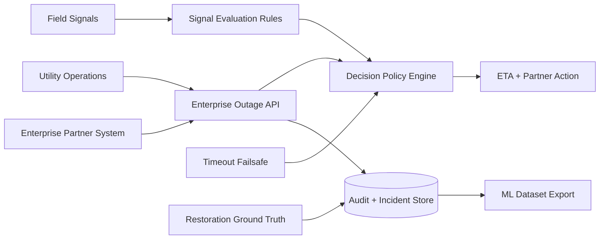

# Enterprise Outage Intelligence Platform

[](LICENSE)


Enterprise outage intelligence API for utility-to-partner coordination. This public-safe product prototype shows how a utility-style organization could coordinate outage ETA, partner operational decisions, audit events, timeout fallback, and restoration ground truth with large enterprise partners such as telecom operators, data centers, industrial estates, hospital networks, or other critical infrastructure operators.

This repository is a synthetic reference implementation. It is not a production system, does not represent a live organizational deployment, and does not imply any actual partnership with named companies.

## Product Status

- Public-safe enterprise product prototype
- Synthetic data, synthetic identifiers, and no real partner payloads
- Tested workflows for incident creation, ETA revision, timeout fallback, restoration closure, idempotency, and audit trail
- ML-ready closed-loop export and simple ETA baseline

## Tech Stack

- Backend: FastAPI, Pydantic
- Persistence: SQLite
- Decision layer: deterministic rules engine
- Testing: pytest, pytest-cov, FastAPI TestClient
- Packaging: Docker, docker-compose, Makefile

## Enterprise Use Case

Large power-dependent organizations need fast, explainable answers during utility outages:

- Should the partner wait for expected utility restoration?
- Should backup operations be prepared?
- Should backup power, fuel logistics, or field escalation be activated now?
- What evidence changed the ETA?
- What ground truth can improve future ETA accuracy?

The platform answers these questions with a two-step operating pattern:

1. A partner or enterprise account workflow sends a synthetic outage event.
2. The API returns an immediate ETA decision and partner action.
3. Field evidence revises the ETA and confidence band.
4. A timeout failsafe prevents ambiguous incidents from stalling.
5. Restoration closure creates ground truth for analytics and future ML.

## Architecture Overview



Core repository areas:

- `apps/api/` FastAPI service, schemas, rules, and demo surface
- `architecture/` system overview and state-machine documentation
- `docs/` API contract, partner integration, governance, product readiness, evaluation, and ML roadmap
- `data/synthetic/` synthetic messages and closed incidents only
- `tests/` API and rule regression coverage
- `infra/` local containerization assets

## Partner Integration Flow

### 1. Create an enterprise outage incident

`POST /api/v1/incidents` accepts a partner-safe outage event and returns an immediate decision.

```json
{
  "client_name": "DemoEnterprisePartner",
  "site_id": "SITE-1001",
  "province": "North Zone",
  "scada_status": "OUTAGE_CONFIRMED",
  "source_event_id": "SRC-EVENT-1001"
}
```

The response includes:

- current incident state
- ETA recommendation
- partner action
- confidence band
- policy explanation
- SLA-style timeout behavior

### 2. Revise ETA from field evidence

`POST /api/v1/incidents/{incident_id}/signals/field` ingests a synthetic field signal, stores it in the audit trail, and revises the ETA when the policy engine finds stronger evidence.

```json
{
  "channel": "FIELD_APP",
  "raw_text": "Field crew reports pole down and conductor snapped near segment A",
  "source_signal_id": "SRC-SIGNAL-1001"
}
```

### 3. Apply timeout fallback

`POST /api/v1/incidents/{incident_id}/timeout-check` applies a deterministic worst-case ETA if the incident has not received useful evidence within the configured timeout window. The operation is idempotent.

### 4. Close the loop with restoration ground truth

`POST /api/v1/incidents/{incident_id}/restore` closes the incident, records restoration metadata, and makes the case available for analytics export.

```bash
python scripts/export_closed_dataset.py --output data/runtime/closed-incidents.jsonl
python scripts/train_eta_baseline.py
```

## Public-Safe Product Prototype

This repo is intentionally safe to publish and review:

- No real credentials, tokens, endpoints, topology, or partner integrations
- No real outage locations, field transcripts, or customer identifiers
- No claim of an actual deployment or partnership with a named company
- Deterministic rules instead of opaque model decisions
- Synthetic data only, with generalized partner and site naming

More detail is available in [docs/security-and-governance.md](docs/security-and-governance.md).

## Product Roadmap

- Enterprise API contract: stronger partner documentation, idempotency policy, standard errors, and audit history
- Operational decision layer: clearer policy explanations, confidence bands, and partner action semantics
- Partner readiness: webhook/API integration guide, data-minimization boundary, and synthetic payload catalog
- Executive demo: incident timeline that shows ETA sent, field revision, timeout, restoration, and dataset export
- ML data product: ETA accuracy monitoring, prolonged-outage risk baseline, and partner-level performance reporting

See [docs/partner-integration.md](docs/partner-integration.md), [docs/product-readiness.md](docs/product-readiness.md), [docs/ml-roadmap.md](docs/ml-roadmap.md), and [docs/evaluation.md](docs/evaluation.md).

## Quick Start

```bash
python -m venv .venv
source .venv/bin/activate  # Windows: .venv\Scripts\activate
pip install -r requirements.txt
python scripts/seed_demo_data.py
uvicorn apps.api.main:app --reload
```

Useful local endpoints:

- API docs: `http://127.0.0.1:8000/docs`
- Executive demo view: `http://127.0.0.1:8000/demo/incidents`
- Health check: `http://127.0.0.1:8000/health`

Optional runtime configuration:

- `OUTAGE_DB_PATH`: SQLite database path for local runs

Quality checks:

```bash
pytest -q
pytest --cov=apps --cov-report=term-missing --cov-fail-under=80
```

## Product Summary

This project demonstrates how a utility-style enterprise outage platform can provide immediate ETA guidance, revise decisions from field evidence, protect partner operations with timeout fallback, and convert restoration outcomes into a measurable data product for future ML.
