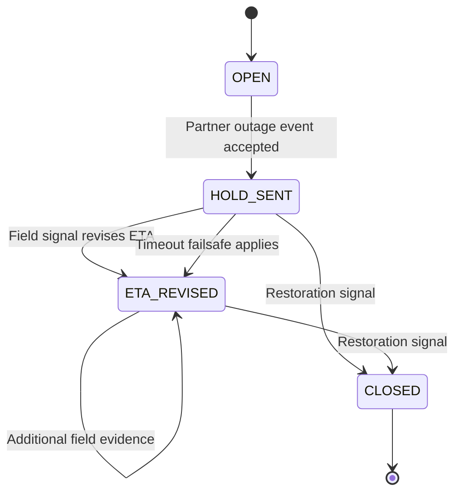

# State Machine

## Transition Policy

| From | Event | To | Policy |
| --- | --- | --- | --- |
| `OPEN` | Create incident | `HOLD_SENT` | Return immediate ETA and partner action. |
| `HOLD_SENT` | Field signal | `ETA_REVISED` | Persist signal, revise ETA, and write audit event. |
| `HOLD_SENT` | Timeout check | `ETA_REVISED` | Apply worst-case fallback once. |
| `ETA_REVISED` | Field signal | `ETA_REVISED` | Persist new evidence and revise decision. |
| `HOLD_SENT` or `ETA_REVISED` | Restoration | `CLOSED` | Record ground truth for analytics. |
| `CLOSED` | Field signal | `CLOSED` | Reject with state conflict. |

Timeout, restore, incident creation, and field signal ingestion are designed to be retry-safe where source identifiers are provided.
