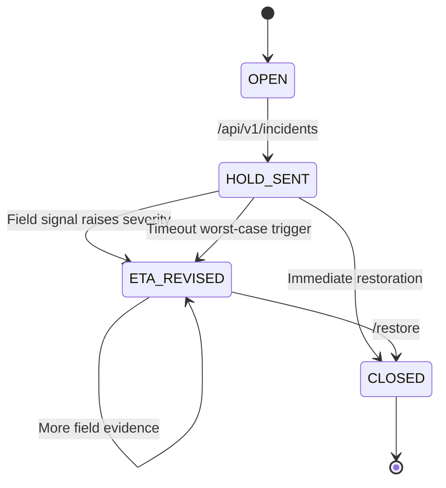

# State Machine

```mermaid
stateDiagram-v2
    [*] --> OPEN
    OPEN --> HOLD_SENT: /api/v1/incidents
    HOLD_SENT --> ETA_REVISED: Field signal raises severity
    HOLD_SENT --> ETA_REVISED: Timeout worst-case trigger
    ETA_REVISED --> ETA_REVISED: More field evidence
    HOLD_SENT --> CLOSED: Immediate restoration
    ETA_REVISED --> CLOSED: /restore
    CLOSED --> [*]
```
