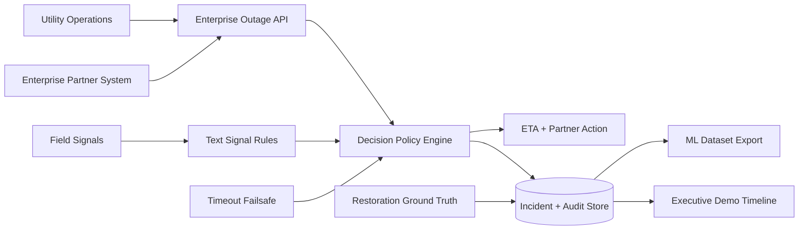

# System Overview

This architecture models a public-safe enterprise outage intelligence product for utility-to-partner coordination.

## Product Responsibilities

- Utility operations provide outage state, field evidence, and restoration closure.
- Enterprise partner systems receive ETA, confidence, policy explanation, and action guidance.
- The API keeps partner writes retry-safe through source IDs and idempotency keys.
- The audit store preserves why decisions changed.
- Dataset export converts closed incidents into ML-ready training and evaluation rows.
