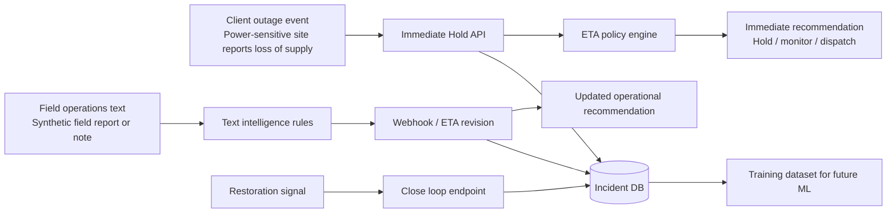

# System Overview

```mermaid
flowchart LR
    A[Client outage event
Power-sensitive site reports loss of supply] --> B[Immediate Hold API]
    B --> C[(Incident DB)]
    B --> D[ETA policy engine]
    D --> E[Immediate recommendation
Hold / monitor / dispatch]

    F[Field operations text
Synthetic field report or note] --> G[Text intelligence rules]
    G --> H[Webhook / ETA revision]
    H --> C
    H --> I[Updated operational recommendation]

    J[Restoration signal] --> K[Close loop endpoint]
    K --> C
    C --> L[Training dataset for future ML]
```
