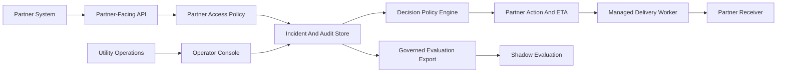

# Private Pilot Implementation Blueprint

This blueprint defines what must be built privately before the outage intelligence prototype can move from public-safe sandbox evidence to a governed private pilot. It is not a production approval document.

## Capability

A utility and enterprise partner pilot team can use this blueprint to align on implementation boundaries: partner access, tenant scope, API contract, delivery worker, observability, data governance, shadow evaluation, and release management.

The goal is to prevent the next phase from becoming "more demo features." The next phase should make the private pilot safe, measurable, and operationally reviewable.

## Fixed Constraints

- The public repository remains synthetic and public-safe.
- No live partner network dispatch is added here.
- No production data is introduced here.
- No model changes partner-facing decisions from this repository.
- Private pilot implementation requires separate security, governance, and operations approval.

## Maturity Stages

| Stage | Current Status | Purpose | Exit Gate |
| --- | --- | --- | --- |
| Public prototype | Implemented here | Demonstrate API flow, evidence reports, scenario coverage, and public-safe governance artifacts. | Readiness gate, scenario matrix, onboarding pack, and public-safe scan pass. |
| Private sandbox | Discussion ready | Review workflow and integration behavior in a private environment using synthetic or governed sandbox inputs. | Owners, partner scope, data boundary, and go/no-go criteria are accepted. |
| Private pilot | Requires private build | Run controlled partner-facing workflows with approved access, tenant boundary, delivery worker, observability, and governance controls. | Pilot metrics, security controls, runbooks, and data handling rules are approved. |
| Production | Not ready | Operate as a live service with production ownership, service objectives, compliance controls, and release management. | Separate production readiness review passes. |

## Target Private Pilot Architecture

## Implementation Workstreams

| ID | Workstream | Private Pilot Requirement | Production Gate |
| --- | --- | --- | --- |
| WS-001 | Partner Access Boundary | Partner-scoped access policy, rotation process, replay window, rate limit, and audit review. | Central partner registry and approved authorization model. |
| WS-002 | Tenant And Site Scope Model | Governed partner-site authorization source with audited access decisions. | Managed tenant policy with migration path. |
| WS-003 | Partner-Facing API Contract | Freeze request and response fields, error taxonomy, idempotency policy, and compatibility rules. | Versioned contract governance and change control. |
| WS-004 | Delivery Worker And Retry Controls | Managed delivery worker, receiver verification, retry schedule, dead-letter handling, and delivery audit. | Operational delivery service with alerting, replay controls, and support ownership. |
| WS-005 | Operational Observability | Metrics, logs, alerts, dashboards, owner rotation, and incident review cadence. | Live alert routing, service objectives, and incident response runbooks. |
| WS-006 | Data Governance And Retention | Approved retained fields, retention period, export controls, de-identification method, and review workflow. | Approved governance policy and recurring audit. |
| WS-007 | Evaluation And Shadow Policy | Side-by-side shadow evaluation on governed pilot rows without changing partner-facing policy. | Measured promotion criteria, bias review, and operator sign-off. |
| WS-008 | Deployment And Release Management | Private environment separation, migration process, rollback path, release checklist, and owner approval flow. | Release automation, rollback verification, environment controls, and support handoff. |

## API Contract Boundary

Freeze these for the private pilot:

- incident create request and response shape
- field signal request and response shape
- timeout check behavior
- restoration closure behavior
- webhook outbox event taxonomy
- standard error response shape
- decision object fields

Private extensions should be designed separately:

- partner authorization context
- receiver verification metadata
- delivery retry policy
- operator audit access
- data export approval state

## Security And Tenant Model

The private pilot must define:

- partner-scoped authorization
- site-scope enforcement
- request replay window
- rate-limit policy
- private auth material rotation
- audit access review
- output redaction review

The public repository already demonstrates the safer boundary: synthetic data, local outbox only, public-safe scan, no live partner dispatch, and no production topology.

## Observability Model

The private pilot should measure:

- incident opened count
- ETA revised count
- timeout fallback rate
- restoration ground-truth coverage
- delivery attempt rate
- delivery success rate
- duplicate event rate
- state conflict rate
- underestimation rate
- pilot pack readiness

Alerts should cover delivery backlog, timeout spikes, audit completeness drop, redaction check failures, and partner scope denial spikes.

## Deployment Path

Use a staged rollout:

1. Keep this repo as the public reference implementation.
2. Create a private sandbox environment with synthetic or governed sandbox inputs.
3. Add managed storage, partner access policy, delivery worker, and observability.
4. Run readiness gate, onboarding pack, pilot evidence report, and shadow evaluation.
5. Move to controlled private pilot only after security and governance review.
6. Treat production as a separate launch path with support ownership and rollback verification.

## Open Decisions

- Which partner class and synthetic site scope should be used for the first private sandbox?
- Which partner authorization source is authoritative in the private pilot?
- Which operational fields can be retained for evaluation and for how long?
- Which service objectives and alert thresholds define pilot success?

## Handoff

The next engineering lane should produce a private implementation plan for authorization, tenant policy, managed storage, delivery worker, observability, and governance review. This public repo should remain the reference demo and evidence pack.
