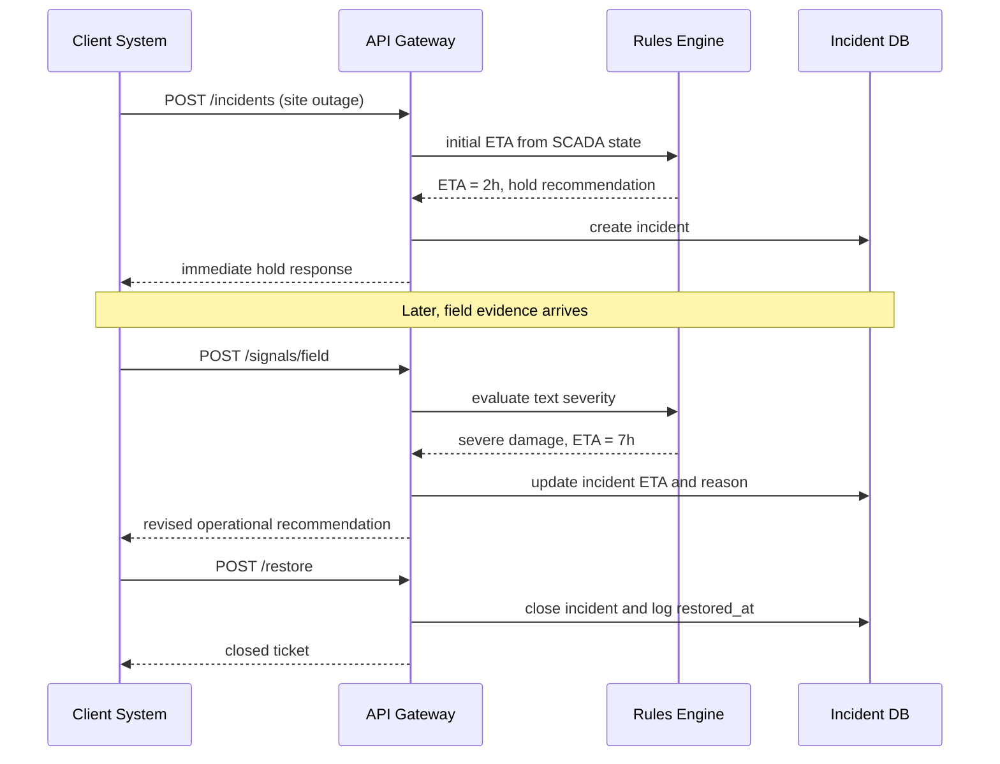

# Sequence Diagram

```mermaid
sequenceDiagram
    participant C as Client System
    participant A as API Gateway
    participant R as Rules Engine
    participant D as Incident DB

    C->>A: POST /incidents (site outage)
    A->>R: initial ETA from SCADA state
    R-->>A: ETA = 2h, hold recommendation
    A->>D: create incident
    A-->>C: immediate hold response

    Note over C,D: Later, field evidence arrives

    C->>A: POST /signals/field
    A->>R: evaluate text severity
    R-->>A: severe damage, ETA = 7h
    A->>D: update incident ETA and reason
    A-->>C: revised operational recommendation

    C->>A: POST /restore
    A->>D: close incident and log restored_at
    A-->>C: closed ticket
```
