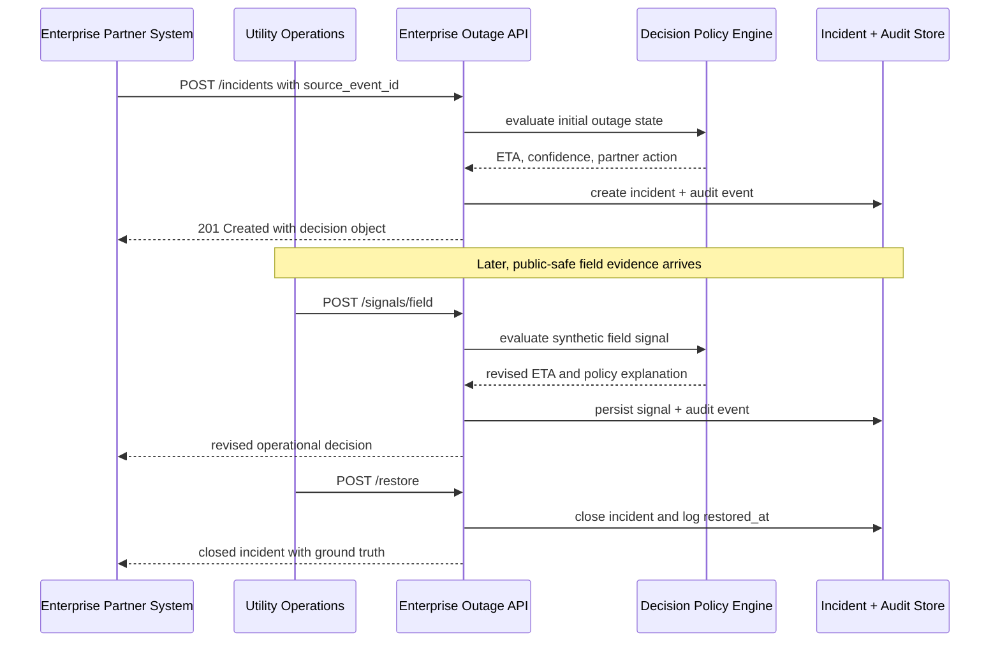

# Partner Coordination Sequence

```mermaid
sequenceDiagram
    participant P as Enterprise Partner System
    participant U as Utility Operations
    participant A as Enterprise Outage API
    participant R as Decision Policy Engine
    participant D as Incident + Audit Store

    P->>A: POST /incidents with source_event_id
    A->>R: evaluate initial outage state
    R-->>A: ETA, confidence, partner action
    A->>D: create incident + audit event
    A-->>P: 201 Created with decision object

    Note over U,D: Later, public-safe field evidence arrives

    U->>A: POST /signals/field
    A->>R: evaluate synthetic field signal
    R-->>A: revised ETA and policy explanation
    A->>D: persist signal + audit event
    A-->>P: revised operational decision

    U->>A: POST /restore
    A->>D: close incident and log restored_at
    A-->>P: closed incident with ground truth
```
